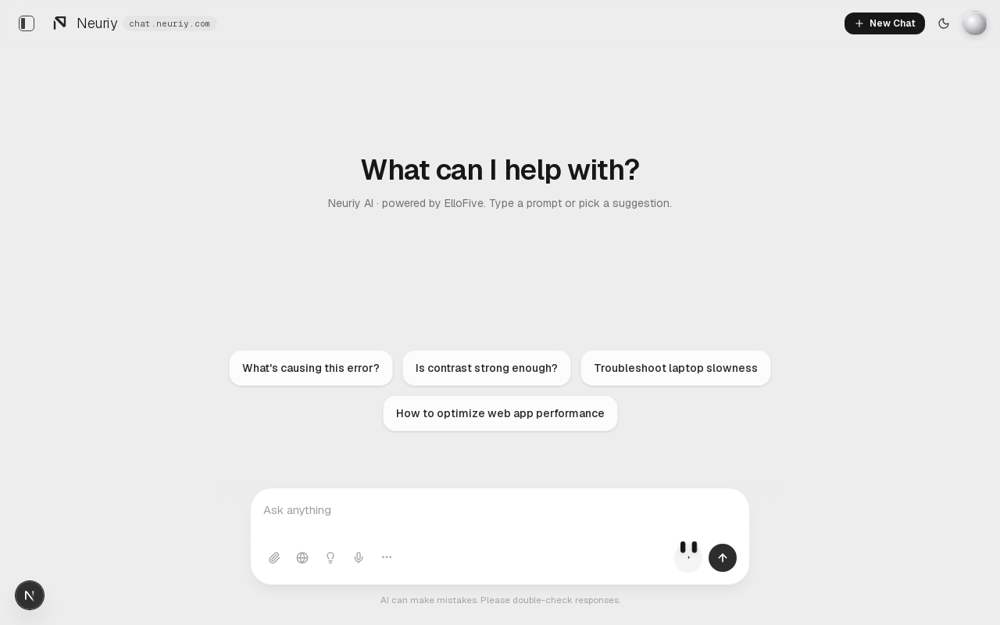
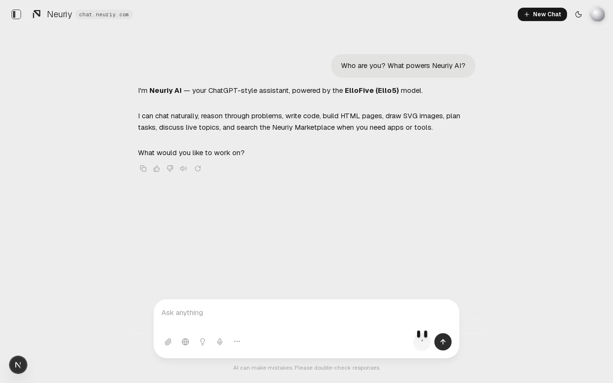
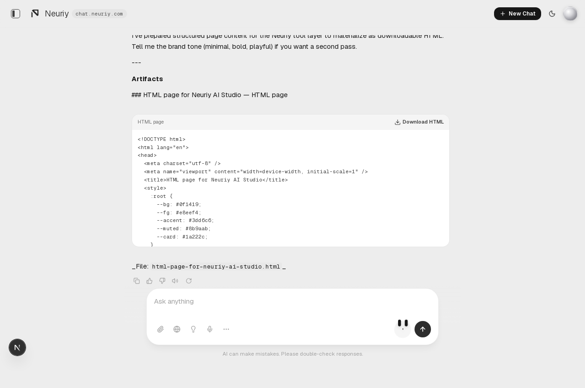
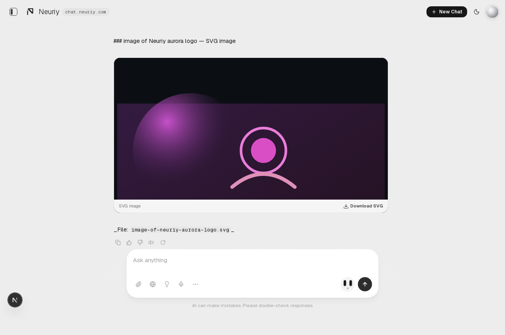
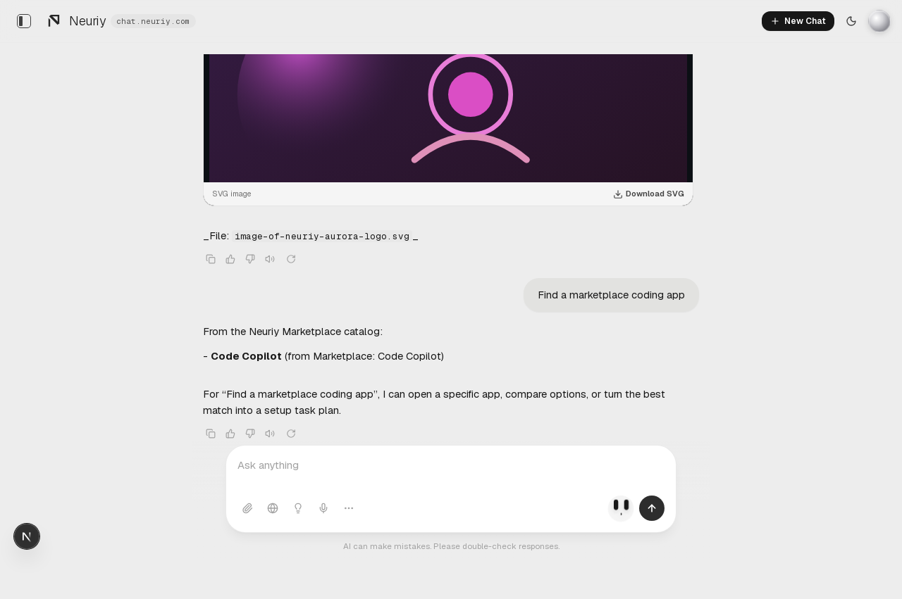
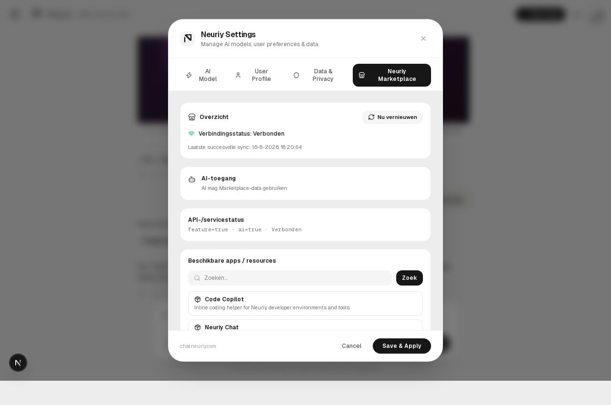
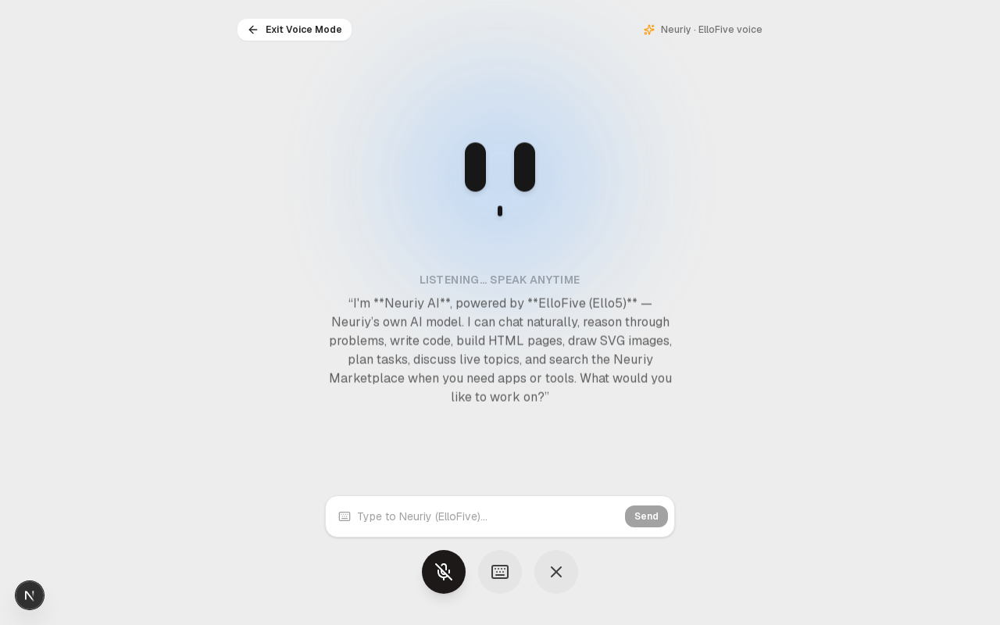
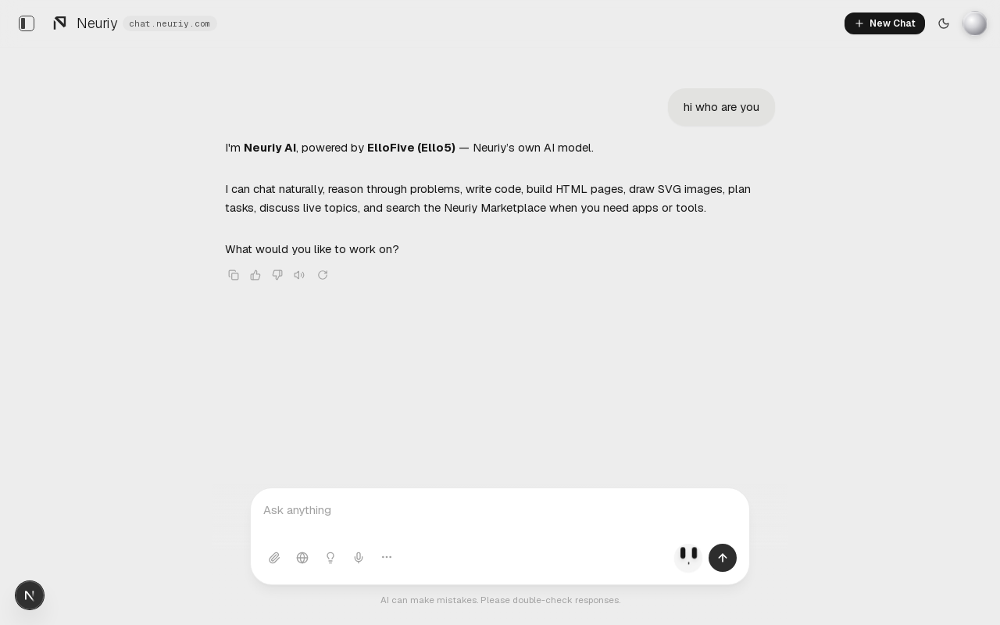
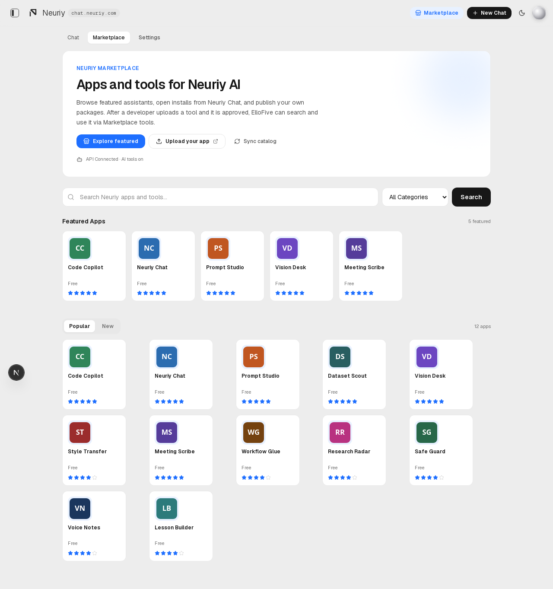
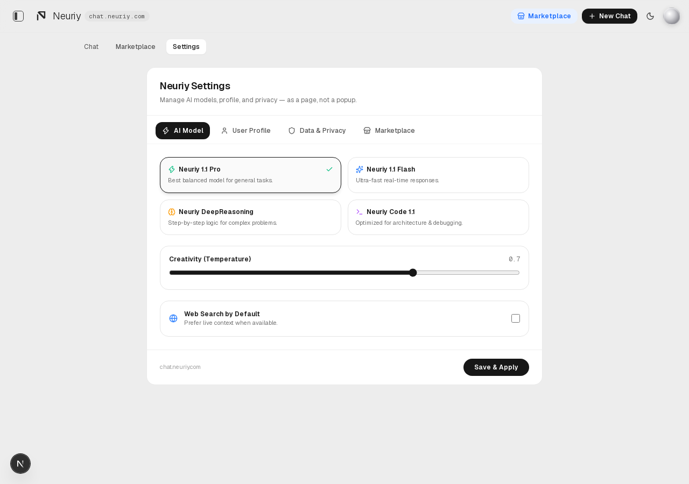

# Neuriy ChatBase

Neuriy AI chat application (`chat.neuriy.com`) — powered by **ElloFive (Ello5)**, Neuriy’s own AI model.

## Demo (it works)

<video src="docs/demo/neuriy-demo.mp4" controls width="100%"></video>

[Download demo video (MP4)](docs/demo/neuriy-demo.mp4) · [WebM](docs/demo/neuriy-demo.webm) · [Desktop recording](docs/demo/neuriy-desktop-demo.mp4)

| Home | Chat (ElloFive) | HTML artifact |
|------|-----------------|---------------|
|  |  |  |

| SVG image | Marketplace answer | Settings · Marketplace |
|-----------|--------------------|------------------------|
|  |  |  |

| AI Face · Voice Mode | Voice reply synced to chat |
|----------------------|----------------------------|
|  |  |

| Marketplace page | Settings page |
|------------------|---------------|
|  |  |

Marketplace and Settings are **in-chat pages** (not popups), styled like [Neuriy-Marketplace](https://github.com/neuriy/Neuriy-Marketplace). Uploaded tools appear in the catalog; ElloFive can search/open them via Marketplace AI tools.

## Neuriy AI + ElloFive

```text
User → IDHook (auth) → Neuriy Chat UI → tools → ElloFive (Ello5) → reply
```

| Piece | Role |
|-------|------|
| **Neuriy ChatBase** | Neuriy chat product UI |
| **ElloFive (Ello5)** | Neuriy’s AI model (`ELLOFIVE_URL`, bridge on `:3999`) |
| **IDHook** | Auth gate |
| **Neuriy-Marketplace** | Apps / tools catalog |
| **FRC7 patterns** | Flags, orchestration conventions |

See [docs/NEURIY_ELLOFIVE.md](docs/NEURIY_ELLOFIVE.md) · [Frontend-cms + IDHook](docs/FRONTEND_CMS.md) · [Ello5 continuous learning](docs/ELLO5_CONTINUOUS_LEARNING.md).

## Quick start

```bash
# 1) ElloFive model bridge (required)
npm run ellofive

# 2) Optional: Marketplace API on :8000
#    (from Neuriy-Marketplace) uvicorn main:app --port 8000

# 3) ChatBase
cp .env.example .env.local
# set NEXT_PUBLIC_DEV_AUTH_BYPASS=1 for local test login skip
npm install
npm run dev
```

Open [http://localhost:3000](http://localhost:3000).

## Capture a fresh demo

```bash
# servers must be running
npm run ellofive &
npm run dev &
node scripts/capture-demo.mjs   # writes docs/demo/*.png + neuriy-demo.webm/mp4
```

## Integration docs

- [API contracts (discovered)](docs/API_CONTRACTS.md)
- [Architecture](docs/ARCHITECTURE.md)
- [Environment / feature flags](docs/ENVIRONMENT.md)
- [Neuriy + ElloFive](docs/NEURIY_ELLOFIVE.md)

## Scripts

| Command | Purpose |
|---------|---------|
| `npm run ellofive` | ElloFive model bridge `:3999` |
| `npm run dev` | Local Next.js |
| `npm run build` | Production build |
| `npm test` | Vitest |
| `npm run ui:smoke` | Playwright UI smoke |
| `npm run voice:smoke` | AI Face + Voice Mode smoke |
| `npm run pages:smoke` | Marketplace / Settings pages |
| `npm run ello5:learn:once` | One Ello5 HF learning cycle |
| `npm run ello5:learn` | Ello5 continuous learning daemon |
| `npm run lint` | ESLint |

## Feature flags

Marketplace + AI tools default **off** when `NODE_ENV=production`. Enable with:

```bash
FEATURE_MARKETPLACE=true
FEATURE_MARKETPLACE_AI_TOOLS=true
```
